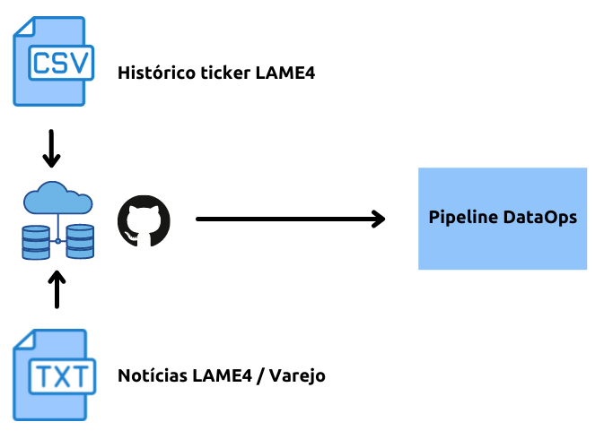
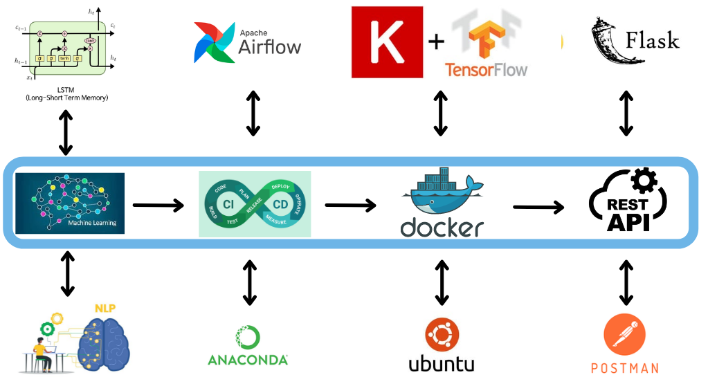
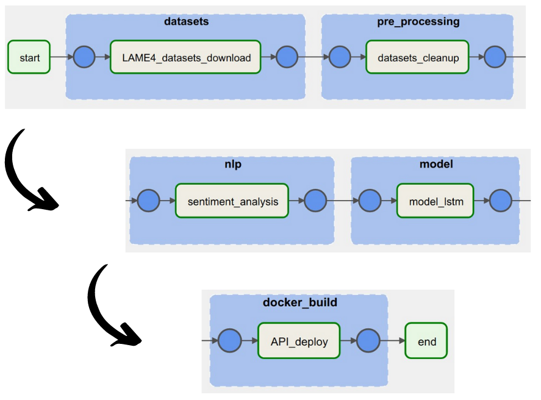
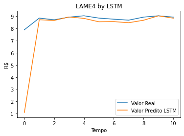

# TCC Pós-graduação Lato Sensu em Inteligência Artificial e Aprendizado de Máquina.

## Descrição

**Instituição:** PUC Minas (PONTIFÍCIA UNIVERSIDADE CATÓLICA DE MINAS GERAIS)

**Curso:** Pós-graduação Lato Sensu em Inteligência Artificial e Aprendizado de Máquina.

**Projeto:** Predição de Preços de Ações Usando Redes LSTM e Análise de Sentimentos, Implementado por um Pipeline DataOps.

Repositório de código do TCC apresentado ao **Curso de Especialização em Inteligência Artificial e Aprendizado de Máquina** como requisito parcial à obtenção do título de Especialista.

**TCC aprovado com nota máxima pela banca examinadora.**

## Definição do Problema

* Mercado Financeiro **Volátil** (condição histórica, verdade conhecida).
* Mercado Financeiro cada vez mais **intolerante** à incertezas (condição psicológica).
* **Perturbação da Ansiedade Generalizada** (condição da sociedade atual).
* **Notícias** e a avaliação do **ânimo** de investimento são informações mandatórias para atuar no Mercado Financeiro.

## Técnicas propostas / Algoritmos de IA e ML

* Redes Neurais Long Short Term Memory (**LSTM**).
* Natural Language Processing (**NLP**).
* Arquitetura que possibilite **ajustes imediatos** no modelo.
* Pipeline **DataOps (Airflow)**.
* Continuous Integration / Continuous Delivery (**CI / CD**).
* Web Service via **API**.

## Imagens

##### Coleta de Dados

# 

##### Arquitetura Proposta

# 

##### Pipeline DataOps Apache Airflow

# 

##### Curvas valores reais x predição (plot_model)

# 

## Development (English Version)

For those exploring Python and Data Science projects to learn something new or different, here follows a summary of the technologies and development approach deployed in this project:

* **OOO** fundamentals and **REST API** consumption using the high regarded [requests](https://requests.readthedocs.io/en/latest/) Python library.
* All components deployed using a **Docker image**.
* [Anaconda](https://www.anaconda.com/) Data Science platform.
* [Apache Airflow](https://airflow.apache.org/) deployment to enable a **DataOps** pipeline.
* Long Short Term Memory Neural Networks (**LSTM**) for predicting stock values.
* Models powered by [Keras](https://keras.io/) and [TensorFlow](https://www.tensorflow.org/).
* Natural Language Processing (**NLP**) to score (rank) news regarding a stock of interest. Improved in this project by [VADER](https://github.com/cjhutto/vaderSentiment) library.
* [Flask](https://flask.palletsprojects.com/en/2.2.x/) Python framework for the **RESTful API** deployed.
* How to correctly define [Flask](https://flask.palletsprojects.com/en/2.2.x/) **endpoints**.
* API usage based on **security tokens** powered by [PyJWT](https://pyjwt.readthedocs.io/en/stable/).
* [NumPy](https://numpy.org/), [pandas](https://pandas.pydata.org/docs/index.html), [scikit-learn](https://scikit-learn.org/stable/) and [SQLAlchemy](https://www.sqlalchemy.org/) libraries for data analysis.

## More Information

**This final assignment** is Free software under the MIT license, see [LICENSE.txt](./LICENSE.txt) for details.

### **Developed by**:

